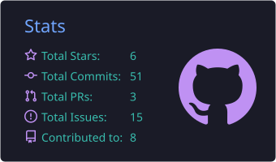
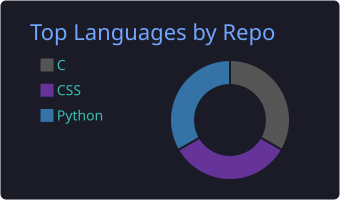

<!-- ==================== HERO ==================== -->

 

<strong>Building efficient, intelligent and deployable multimodal systems.</strong>

 

 

---

<!-- ==================== TECH STACK ==================== -->

<h2 align="center">Technology Stack</h2>

Languages, frameworks and engineering tools used in research and development

 

 
 

---

<!-- ==================== CONTRIBUTIONS ==================== -->

<h2 align="center">Engineering Snapshot</h2>

Repository activity, language distribution and contribution consistency

 

 

 
 

---

<!-- ==================== ACTIVITY ==================== -->

<h2 align="center">GitHub Activity</h2>

Contribution history and development activity

 

<picture>
<source media="(prefers-color-scheme: dark)" srcset="https://raw.githubusercontent.com/wei1305/wei1305/output/github-contribution-grid-snake-dark.svg">
<source media="(prefers-color-scheme: light)" srcset="https://raw.githubusercontent.com/wei1305/wei1305/output/github-contribution-grid-snake.svg">

</picture>

 

<h3 align="center">Contribution Timeline</h3>

 
 

<h3 align="center">3D Contribution Landscape</h3>

 
 

---

<!-- ==================== FOOTER ==================== -->

<h3>Let’s build something intelligent.</h3>

Researching efficient VLA systems, AI agents and multimodal intelligence.

 

 

